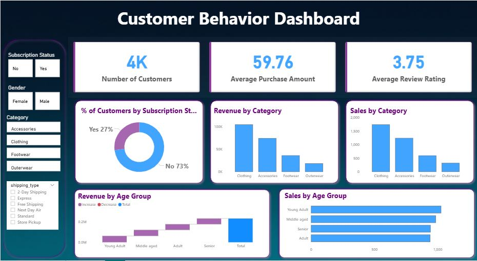

# 🛍️ Customer Behavior – Data Analyst Portfolio Project
**Author:** Oumaima Bendjaj

## 📌 Project Overview
This project is a complete, industry-standard, end-to-end data analytics workflow that reflects the real responsibilities of professional analysts in modern business environments. It covers every key stage of the process, from data preparation and modeling to insight generation, visualization and reporting.
 
The goal is to simulate a corporate-grade analytics workflow and show how raw data can be turned into strategic business intelligence through four stages:
 
- ✅ **Data Preparation, Modeling & EDA (Python):** clean and transform the raw dataset so it is ready for analysis.
- ✅ **Data Analysis (SQL):** simulate business transactions and run queries to uncover insights on customer segments, loyalty and purchase drivers.
- ✅ **Visualization & Insights (Power BI):** build an interactive dashboard that highlights key patterns and trends, helping stakeholders make data-driven decisions.
- ✅ **Report & Presentation:** write a clear report summarizing key findings and business recommendations, and prepare a presentation that communicates them visually to stakeholders.
  
## 📸 Dashboard Previews
  

  
## 🧰 Tools & Technologies
 
### 🛠️ Data Preparation & EDA
- **Python**
  - pandas
  - Data Cleaning & Feature Engineering
  - Exploratory Data Analysis (EDA)
### 🗄️ Data Analysis
- **SQL (PostgreSQL)**
  - Window Functions
  - Aggregation Functions
  - Common Table Expressions (CTEs)
  - Ranking Functions
  - Subqueries
  - Max / Min / Average
  
### 📊 Data Visualization
- **Power BI**
  - DAX
  - Data Modeling
  - Interactive Dashboards
 
